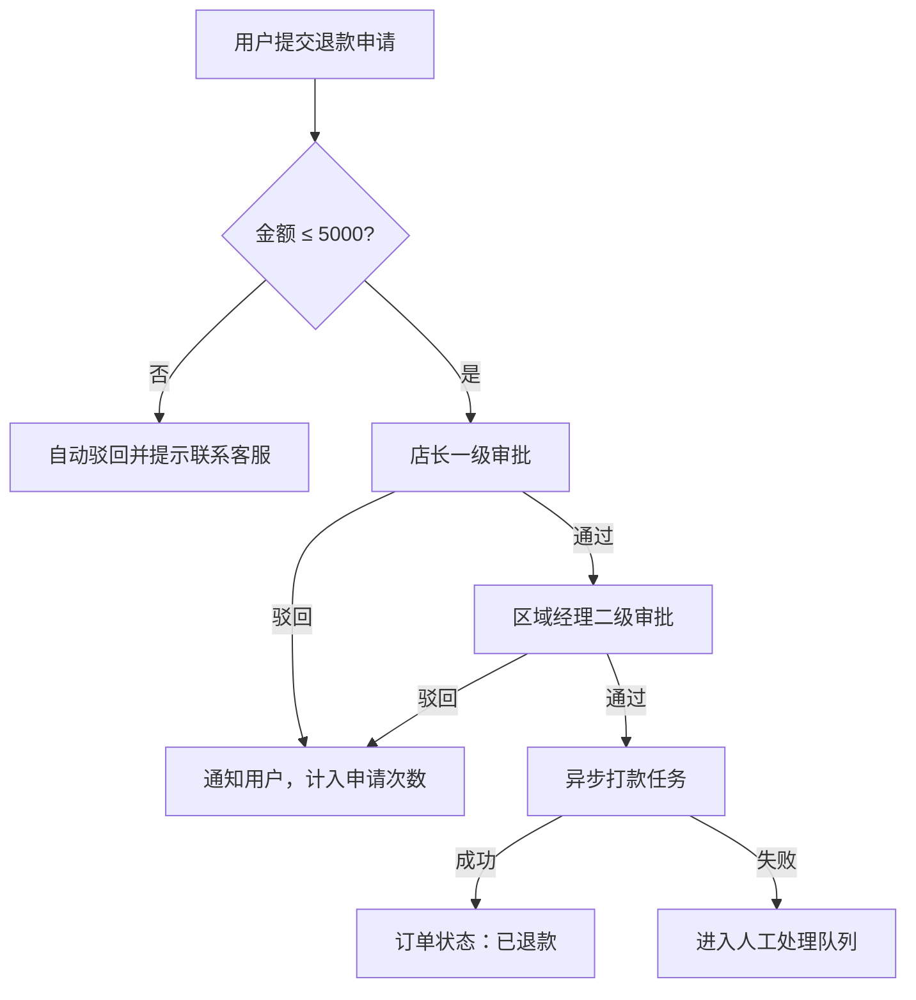

# PRD 审查报告输出示例

> 以下为虚构业务「订单退款审批」的示例片段，展示阶段二各章节的预期密度与写法。实际报告须基于真实 PRD 与代码事实填写。

---

## 📋 一、需求实现综合评估表

| 评估维度 | 现状描述 | PRD 要求 | 可行性 | 优先级 | 备注 |
|---------|---------|---------|-------|-------|------|
| 实现方案 | 退款为客服后台一键操作，无审批流 | 用户申请 → 两级审批 → 自动打款 | ⚠️ | 高 | 需新增审批状态机与通知 |
| 技术方案 | 同步调用支付网关退款 API | 审批通过后异步任务打款，失败可重试 | ✅ | 高 | 可与现有 Job 队列复用 |
| 安全性 | 仅 `admin` 角色可退款 | 申请人、审批人、财务分权 | ⚠️ | 高 | 需细化 RBAC 与操作审计 |
| 边界（功能边界） | 仅支持全额退款 | 支持部分退款且单笔上限 5000 元 | ⚠️ | 中 | PRD 未说明与优惠券叠加规则 |
| 边界（数据边界） | `refund_amount` 等于订单实付 | 部分退款后订单状态为「部分退款」 | ✅ | 中 | 需扩展订单状态枚举 |
| 边界（权限/角色边界） | 无审批角色 | 店长一级、区域经理二级 | ✅ | 高 | 角色表需新增映射 |
| 业务逻辑 | 退款后订单直接关闭 | 审批拒绝可再次申请，最多 3 次 | ⚠️ | 中 | 与 PRD 第 3.2 节次数限制需对齐代码计数 |

---

## 🔄 二、PRD 改造方案 vs 当前方案对比表

| 对比项 | 当前方案 | PRD 改造方案 | 差异说明 | 影响评级 |
|-------|---------|------------|---------|---------|
| 退款入口 | 仅后台客服操作 | C 端用户自助申请 | 新增前端页面与申请 API | 高 |
| 审批流程 | 无 | 两级审批 + 超时自动驳回 | 新建审批模块与定时任务 | 高 |
| 打款时机 | 申请即打款 | 终审通过后打款 | 支付调用点后移，需防重复打款 | 高 |
| 通知 | 无 | 短信 + 站内信 | 接入消息中心模板 | 中 |

---

## 🛠️ 三、需要修改的范围清单

| 类型 | 名称/路径 | 修改内容描述 | 修改复杂度 | 优先级 |
|-----|---------|-----------|---------|-------|
| 页面 | `src/pages/order/RefundApply.vue` | 新增用户退款申请页 | 中 | 高 |
| 组件 | `src/components/ApprovalTimeline.vue` | 展示审批进度 | 低 | 中 |
| 接口/API | `POST /api/v1/refunds` | 创建申请、查询状态 | 中 | 高 |
| 接口/API | `POST /api/v1/refunds/{id}/approve` | 审批通过/驳回 | 中 | 高 |
| 数据模型 | `models/refund_request.py` | 新增审批状态、审批人、次数 | 中 | 高 |
| 业务逻辑 | `services/refund_service.py` | 状态机、打款、次数校验 | 高 | 高 |
| 配置/权限 | `config/rbac.yaml` | 新增 `store_manager`、`region_manager` | 低 | 高 |

---

## 🗺️ 四、关键流程图 / 结构图（按需生成）



> 图表说明：退款仅在金额门槛内进入两级审批；终审通过后由异步任务打款，失败不自动重试给用户端，而是转人工队列。

---

## ⚠️ 五、冲突与问题清单

| 编号 | 冲突/问题类型 | 描述 | 涉及范围 | 严重程度 |
|-----|------------|------|---------|---------|
| C-01 | PRD内部冲突 | 第 2 章写「部分退款」，第 5 章写「仅全额退款」 | 退款金额计算 | 高 |
| C-02 | PRD与代码冲突 | 代码中订单关闭后不可再发起任何售后，PRD 允许驳回后再次申请 | `order_service.close` | 高 |
| C-03 | 概念模糊 | 「申请次数」是否包含已驳回与已撤销 | 次数计数逻辑 | 中 |
| C-04 | 逻辑缺失/遗漏 | 未定义审批超时时间与时效内无人处理的升级策略 | 审批 SLA | 中 |

---

## ❓ 六、待确认问题列表（含建议方案）

**问题 Q-01：部分退款后是否允许继续发起第二次部分退款？**

> **背景**：PRD 2.1 支持部分退款，但未说明累计退款上限是否等于实付金额；现有代码仅支持单次全额退款。

**可选方案：**

| 方案 | 描述 | 优点 | 缺点 |
|-----|------|------|------|
| 方案 A | 允许多次部分退款，累计不超过实付 | 灵活，贴合 PRD「部分退款」字面 | 状态与对账复杂 |
| 方案 B | 仅允许一次部分退款，剩余需走客服 | 实现简单，与现有关闭逻辑接近 | 用户体验受限 |

**⭐ 建议选择：方案 A**

> **理由**：与 PRD「部分退款」方向一致，且可通过 `refunded_total` 字段约束上限。
>
> **业务场景 Demo**：
> 场景：用户购买 1000 元商品，先申请退 300 元获批，一周后因质量问题再申请退 200 元。
> 方案 A 的表现：第二次申请校验累计 500 ≤ 1000，可继续审批。
> 方案 B 的表现：第一次部分退款后订单进入特殊状态，第二次申请被拒绝。
> 因此，在「多次售后」场景下，方案 A 更合适，因 PRD 未限制次数且强调部分退款能力。

---

## 阶段一输出示例（复述理解）

```
## 我对本次 PRD 的理解

### 核心目标
为 C 端用户提供可追踪的退款审批流程，替代当前仅客服后台操作的一次性全额退款，降低误操作与权限风险。

### 主要改造内容
1. 用户端退款申请页与申请记录
2. 店长、区域经理两级审批
3. 审批通过后异步打款与失败人工处理
4. 部分退款及单笔/累计金额规则
5. 短信与站内信通知
6. 申请次数限制（PRD 表述待澄清）

### 涉及范围初判
订单模块、支付/退款服务、权限与角色、消息通知、前端订单详情与申请页

### 我有以下不确定点（如有）
- 「部分退款」与「仅全额退款」章节表述不一致，以哪一章为准？
- 审批超时与无人审批时的升级规则未写清
```
